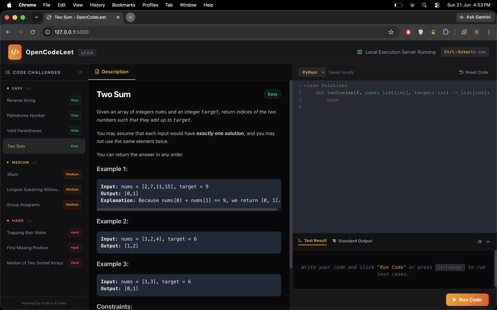

# OpenCodeLeet

> This repository was created to test the capabilities of [OpenCode](https://opencode.ai) and is for learning purposes only.

[](https://python.org)
[](https://flask.palletsprojects.com)
[](https://kotlinlang.org)
[](https://docs.python.org/3/library/unittest.html)

A local LeetCode-style coding challenge platform supporting **Python** and **Kotlin**. Solve algorithm problems in a web editor, run code against test cases on a local server, and get instant feedback.



## Quick Start

```sh
pip install flask
python3 python/app.py
```

Open [http://127.0.0.1:5000](http://127.0.0.1:5000) in your browser.

> **Tip:** Press `Ctrl+Enter` (or `Cmd+Enter` on Mac) to run code without clicking the button.

### Kotlin (Optional)

To solve challenges in Kotlin, install the [Kotlin compiler](https://kotlinlang.org). Choose your language from the dropdown in the editor toolbar — the server will use `kotlinc` + `java -jar` to compile and run.

## Features

- **Dual language support** — switch between Python and Kotlin per challenge, code saved independently per language
- **Code editor** with syntax highlighting, line numbers, bracket matching (CodeMirror with Dracula theme)
- **Server-side execution** in an isolated subprocess with a configurable timeout (default 3s)
- **Test result parsing** — results extracted from stdout markers (`ALL_TESTS_PASSED`, `TEST_FAILED:`, `ERROR:`)
- **Solution unlock** — after 3 failed attempts on a challenge, a reference solution is revealed
- **Execution timing** — elapsed time displayed per run in milliseconds
- **Auto-save** — code persisted to `localStorage` per challenge per language, survives page reloads
- **Error line highlighting** — error locations shown in the editor gutter and scrolled into view
- **Difficulty-based sidebar** — challenges grouped by Easy / Medium / Hard with color-coded badges

## Run Tests

```sh
python3 python/test_app.py
```

## Adding a Challenge

1. Create a new `.py` file in `challenges/` (e.g., `challenges/my-challenge.py`)
2. Define a `CHALLENGE` dict with the keys below
3. Restart the server — the loader picks up new files automatically

| Key | Description |
|-----|-------------|
| `id` | URL-safe slug (e.g., `"my-challenge"`) |
| `title` | Display name (e.g., `"1. My Challenge"`) |
| `difficulty` | `"Easy"`, `"Medium"`, or `"Hard"` |
| `description` | HTML string describing the problem |
| `starter_code` | Dict keyed by language — initial code the user sees |
| `solution_code` | Dict keyed by language — reference solution (unlocked after 3 fails) |
| `test_code` | Dict keyed by language — assertion harness that prints stdout markers |

Each language entry must contain complete, runnable code that prints one of these markers:
- `ALL_TESTS_PASSED`
- `TEST_FAILED: <message>`
- `ERROR: <message>`

## Project Structure

```
challenges/             One .py file per challenge (auto-imported)
├── two-sum.py
├── reverse-string.py
├── palindrome-number.py
├── valid-parentheses.py
├── longest-substring.py
├── three-sum.py
├── group-anagrams.py
├── trapping-rain-water.py
├── first-missing-positive.py
└── median-two-arrays.py
python/
├── app.py              Flask routes and server entrypoint
├── loader.py           Auto-imports challenge files, strips title numbers
├── config.py           App constants (timeout, host, port, version)
├── runner.py           Subprocess execution engine (Python + Kotlin)
├── test_app.py         Unit tests (16 tests)
└── templates/
    └── index.html      Single-page frontend (Tailwind, CodeMirror, language switcher)
```

## Tech Stack

| Layer | Technology |
|-------|-----------|
| Backend | Python, Flask |
| Frontend | Tailwind CSS, CodeMirror 5, FontAwesome |
| Languages | Python (built-in), Kotlin (requires `kotlinc`) |
| Testing | unittest (16 tests) |
| Execution | Subprocess with 3s timeout |
| Solution Reveal | After 3 failed attempts per challenge per language |

## License

This project is for educational purposes. Challenge problems are sourced from [LeetCode](https://leetcode.com/).
